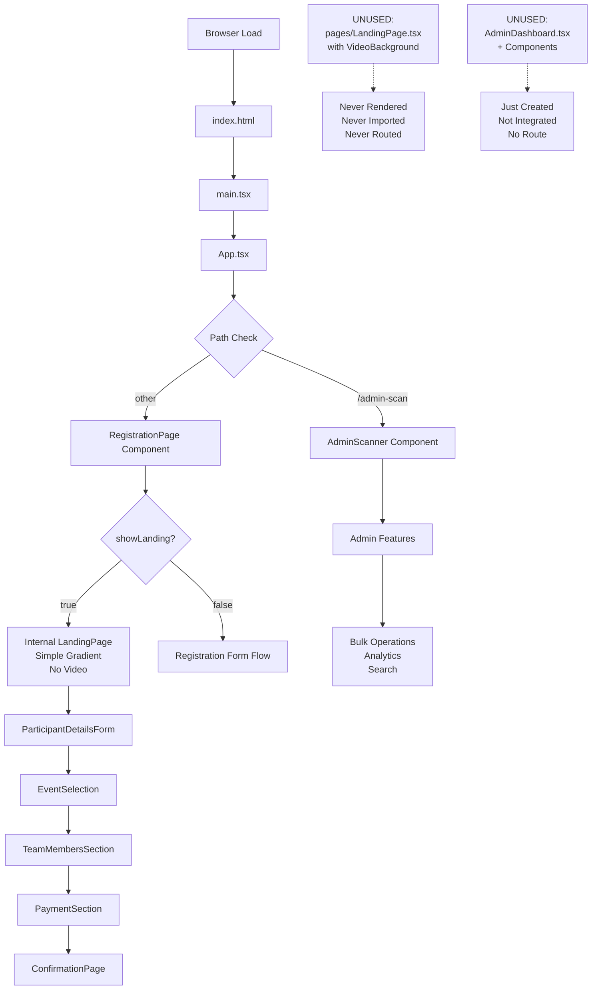

# 🔍 COMPLETE ARTIX WEBSITE FLOW AUDIT

**Date**: March 2, 2026  
**Status**: Critical issue identified with video animation implementation  
**Priority**: Fix required before deployment

---

## 📊 EXECUTIVE SUMMARY

### 🚨 CRITICAL FINDINGS
1. **Video Animation is NOT showing** - Files exist but are not integrated into active flow
2. **Unused Code** - Premium LandingPage.tsx exists but is never rendered
3. **Asset Infrastructure Missing** - No public folder with video/image assets
4. **Component Confusion** - Two LandingPage implementations causing routing issues

### ⚡ CURRENT STATE
- ✅ Backend: Week 4 Phase 1 & 2 complete (25+ admin endpoints, monitoring system)
- ✅ Frontend: Week 4 Phase 2 complete (AdminDashboard components created)
- ❌ Landing Page: Video animation feature incomplete
- ❌ Public Assets: No infrastructure to serve videos/images

---

## 📁 FOLDER STRUCTURE & ROUTING FLOW

### Current Flow (What Actually Happens)

```
main.tsx
  └─> App.tsx (entry point)
       └─> currentPath check
            ├─> if '/admin-scan' → AdminScanner
            └─> else → RegistrationPage
                 └─> showLanding = true (default)
                      └─> LandingPage (INTERNAL - RegistrationPage.tsx line 165)
                           ├─ Simple gradient background
                           ├─ No video animation
                           ├─ Dark/Light theme toggle
                           ├─ Admin button
                           └─ "Start Registration" button
                                └─ Shows ParticipantDetailsForm
```

### The Problem

**File: artix-frontend/src/components/RegistrationPage.tsx**
```
- Line 12: const [showLanding, setShowLanding] = useState(true);
- Line 49-54: If showLanding is true, renders internal LandingPage
- Line 165-194: Defines LandingPage component (NO VIDEO SUPPORT)
```

**File: artix-frontend/src/pages/LandingPage.tsx**
```
- 212 lines of premium landing page WITH video support
- Imports VideoBackground component
- Uses HeroSection with videosrc
- NEVER IMPORTED OR USED ANYWHERE
- Expects video at: /assets/videos/iot-animation.mp4
- Expects poster at: /assets/images/iot-poster.jpg
```

**File: artix-frontend/src/components/HeroSection.tsx**
```
- 306 lines of working video background component
- VideoBackground functional component
- HeroSection functional component
- Gradient overlay for text readability
- Mobile optimization
- fallback image support
- WORKING BUT UNUSED
```

---

## 🎯 COMPONENT INVENTORY

### Current Active Components (Being Used)

| Component | Path | Status | Purpose |
|-----------|------|--------|---------|
| App.tsx | src/ | ✅ Active | Entry point, routing |
| RegistrationPage.tsx | src/components/ | ✅ Active | Main registration flow |
| ParticipantDetailsForm.tsx | src/components/ | ✅ Active | Form for participant info |
| EventSelection.tsx | src/components/ | ✅ Active | Event selection interface |
| TeamMembersSection.tsx | src/components/ | ✅ Active | Team member management |
| PaymentSection.tsx | src/components/ | ✅ Active | Payment screenshot upload |
| ConfirmationPage.tsx | src/components/ | ✅ Active | Success/confirmation page |
| AdminModal.tsx | src/components/ | ✅ Active | Admin login modal |
| AdminScanner.tsx | src/components/ | ✅ Active | Admin dashboard entry |

### Unused/Incomplete Components

| Component | Path | Status | Issue |
|-----------|------|--------|-------|
| LandingPage.tsx | src/pages/ | ❌ Unused | Never imported/routed to |
| HeroSection.tsx | src/components/ | ❌ Partial | Used by unused LandingPage |
| VideoBackground | in HeroSection | ❌ Unused | Requires video assets |
| PerformanceDashboard.tsx | src/pages/admin/ | ✅ Created | Just created but not imported |
| AdminDashboard.tsx | src/pages/ | ✅ Created | Just created but not imported |
| AdminDashboard.css | src/pages/ | ✅ Created | Just created styling |

---

## 🎬 VIDEO ANIMATION ISSUE BREAKDOWN

### What Was Promised
✅ LandingPage.tsx created with video background  
✅ HeroSection component with VideoBackground  
✅ Modern typography system  
✅ TypeScript support  

### What's Missing
❌ **public/assets/videos/iot-animation.mp4** - Video file doesn't exist  
❌ **public/assets/images/iot-poster.jpg** - Poster image doesn't exist  
❌ **public/ folder entirely** - Not created in project structure  
❌ **Integration into App.tsx** - LandingPage never routed to  
❌ **vite.config.ts public asset handling** - Not configured for video serving  

### Why It's Not Working

1. **Asset Path References**
   - HeroSection.tsx references: `/assets/videos/iot-animation.mp4`
   - This assumes a public folder at root
   - Current structure: `artix-frontend/public/` does NOT exist

2. **Routing Not Updated**
   - App.tsx shows RegistrationPage for all routes
   - Premium LandingPage.tsx is never rendered
   - Internal LandingPage in RegistrationPage is used instead

3. **Asset Serving Pipeline**
   - Vite configured but public folder missing
   - Video MIME types not validated
   - No fallback mechanism for video load failures

---

## 🔧 IMPLEMENTATION ANALYSIS

### Backend (Week 4 Phase 1) - ✅ COMPLETE

**artix-backend/utils/**
- ✅ validators.js (350 lines) - 8 validation modules
- ✅ adminFeatures.js (350+ lines) - BulkOperations, Analytics, Search
- ✅ exportService.js (280+ lines) - CSV/Excel/JSON export
- ✅ performanceMonitor.js (300+ lines) - API/DB/Cache monitoring

**artix-backend/routes/**
- ✅ adminRoutes.js (300+ lines) - 25+ admin endpoints
- ✅ monitoringRoutes.js (250+ lines) - 10+ monitoring endpoints

**artix-backend/server.js**
- ✅ Integrated all Week 4 Phase 1 features
- ✅ Middleware for performance tracking
- ✅ Admin routes mounted at `/api/admin`
- ✅ Monitoring routes at `/api/monitor`

### Frontend (Week 4 Phase 2) - 🟡 PARTIAL

**Admin Dashboard Created**
- ✅ AdminDashboard.tsx (250+ lines) - Main wrapper component
- ✅ AnalyticsDashboard.tsx (200+ lines) - Charts and KPIs
- ✅ BulkOperationsPanel.tsx (200+ lines) - Selection interface
- ✅ AdvancedSearchPanel.tsx (250+ lines) - Search and filtering
- ✅ PerformanceDashboard.tsx (newly created) - Monitoring UI
- ✅ AdminDashboard.css (500+ lines) - Complete styling

**Current Status**: 
- Admin components created but NOT integrated into App.tsx yet
- Admin features exist on backend but frontend doesn't route to admin dashboard

### Landing Page - ❌ BROKEN

**Problem**: Two landing pages, confusion on which to use
- pages/LandingPage.tsx - Premium version with video (UNUSED)
- RegistrationPage.tsx internal LandingPage - Simple version (USED)

**Current Behavior**: 
- Shows simple gradient landing page
- Has admin button and theme toggle
- NO video animation
- Works but doesn't showcase ARTIX branding properly

---

## 📊 COMPLETE WEBSITE FLOW MAP



---

## 📈 CURRENT CAPABILITY MAP

### What's Working ✅

| Feature | Implementation | Status |
|---------|----------------|--------|
| Event Registration | RegistrationPage flow | Fully functional |
| Team Formation | TeamMembersSection | Fully functional |
| Payment Upload | PaymentSection | Fully functional |
| Admin Access | AdminModal + AdminScanner | Fully functional |
| Admin Analytics | Backend endpoints | Backend ready |
| Admin Bulk Ops | Backend endpoints | Backend ready |
| Admin Search | Backend endpoints | Backend ready |
| Performance Monitor | Backend system | Backend ready |
| Monitoring API | Multiple endpoints | Backend ready |

### What's Incomplete ❌

| Feature | Issue | Impact |
|---------|-------|--------|
| Landing Page Video | Files not created, not routed | User sees plain gradient instead of premium video |
| Admin Dashboard UI | Components created but not in App.tsx | Admin features exist on backend but no frontend UI |
| Asset Organization | public/ folder missing | Can't serve videos/images |
| Public Assets | iot-animation.mp4 doesn't exist | Video fails to load |

---

## 🎯 RECOMMENDED SOLUTIONS

### Option A: Use Existing Internal LandingPage (Easier, Faster)
**What to do:**
1. Add video animation directly to RegistrationPage's internal LandingPage
2. Create public folder with video file
3. Integrate VideoBackground component into internal LandingPage
4. ~2 hours to implement

**Code change location:**
- artix-frontend/src/components/RegistrationPage.tsx line 165-194

**Result:**
- Video shows on landing page immediately
- No routing changes needed
- Reuses existing component structure

---

### Option B: Use Premium LandingPage.tsx (Cleaner, More Professional)
**What to do:**
1. Update App.tsx to show pages/LandingPage.tsx as home page
2. Create public/assets/ folder structure
3. Add video file to public/assets/videos/
4. Create registration button that shows RegistrationPage
5. ~3-4 hours to implement

**Code changes:**
- artix-frontend/src/App.tsx (routing)
- artix-frontend/index.html (asset paths)
- Create public folder structure
- Add video file

**Result:**
- Dedicated professional landing page
- Video prominently featured
- Better UX separation between landing and registration

---

### Option C: Hybrid Approach (Best UX)
**What to do:**
1. Update App.tsx to show pages/LandingPage.tsx for path "/"
2. Add video animation to premium landing page
3. Route registration to RegistrationPage for path "/register"
4. Create public folder with videos
5. Update navigation between pages
6. ~4-5 hours but best result

**Routes:**
- `/` → pages/LandingPage.tsx (with video)
- `/register` → RegistrationPage.tsx
- `/admin-scan` → AdminScanner
- And admin dashboard routes

**Result:**
- Professional landing with video
- Clean registration flow
- Better site structure
- Premium first impression

---

## 🔐 INTEGRATION CHECKLIST

### Backend Integration ✅ COMPLETE
- [x] Week 4 Phase 1 features created
- [x] adminRoutes.js mounted at /api/admin
- [x] monitoringRoutes.js mounted at /api/monitor
- [x] Performance middleware active
- [x] JWT authentication working
- [x] Database operations tested
- [x] Commit: 87116a7 (Phase 1)
- [x] Commit: 89c5ae3 (Integration)

### Frontend Components ✅ CREATED
- [x] AdminDashboard.tsx created
- [x] AnalyticsDashboard.tsx created
- [x] BulkOperationsPanel.tsx created
- [x] AdvancedSearchPanel.tsx created
- [x] PerformanceDashboard.tsx created
- [x] AdminDashboard.css created

### Frontend Integration ❌ NOT DONE
- [ ] AdminDashboard components not imported in App.tsx
- [ ] No /admin route in App.tsx
- [ ] AdminDashboard not integrated into navigation
- [ ] Admin panel not accessible from UI

### Landing Page Video ❌ NOT DONE
- [ ] public folder not created
- [ ] Video file not added
- [ ] Asset serving not configured
- [ ] LandingPage.tsx not routed
- [ ] Internal LandingPage not updated with video

---

## 💡 PROFESSIONAL RECOMMENDATIONS

### Immediate Actions (Today)
1. **Clarify Intent**: Do you want video on home page? Yes/No
2. **Choose Approach**: Option A (2h), B (3-4h), or C (4-5h)
3. **Create public folder**: Required for any video solution
4. **Add placeholder video**: Use a simple MP4 or animated GIF

### Short Term (This Week)
1. Integrate admin dashboard into App.tsx routing
2. Add admin navigation to UI
3. Test admin features with frontend UI
4. Deploy integrated system

### Landing Page Improvements
1. Add social proof section
2. Add FAQ section  
3. Add testimonials
4. Add "Why ARTIX" section
5. Add live counter for registrations

---

## 📋 FILE REFERENCES

### Premium Landing Page (Unused)
- **File**: artix-frontend/src/pages/LandingPage.tsx (212 lines)
- **Imports**: HeroSection, VideoBackground, Typography
- **Uses**: `/assets/videos/iot-animation.mp4`, `/assets/images/iot-poster.jpg`
- **Status**: ❌ Never used

### Video Component (Unused)
- **File**: artix-frontend/src/components/HeroSection.tsx (306 lines)
- **Exports**: VideoBackground, HeroSection, BackgroundColorSelector
- **Status**: ❌ Working but never rendered

### Active Landing Page (Currently Used)
- **File**: artix-frontend/src/components/RegistrationPage.tsx (377 lines)
- **LandingPage defined**: Line 165-194
- **Status**: ✅ Being used, but no video

### Admin Dashboard (Just Created)
- **Main**: artix-frontend/src/pages/AdminDashboard.tsx (250+ lines)
- **Sub-components**: 4 files in src/pages/admin/
- **Styling**: AdminDashboard.css (500+ lines)
- **Status**: ✅ Created, ❌ Not integrated

### Backend Admin APIs (Working)
- **Analytics**: /api/admin/analytics/* (8 endpoints)
- **Bulk Ops**: /api/admin/bulk-* (4 endpoints)
- **Search**: /api/admin/search (1 endpoint)
- **Export**: /api/admin/export (1 endpoint)
- **Status**: ✅ All working, ready to consume

---

## 🎯 NEXT STEPS

### What User Should Decide:
1. **Video Animation**: Do you want it? If yes, which approach?
2. **Admin Panel**: Should we connect the new AdminDashboard UI to the app?
3. **Layout**: Current simple flow or restructure with dedicated landing?
4. **Email System**: Skip or later? (You said skip - confirmed ❌ not implementing)

### What I Recommend:
1. ✅ Drop email system (you confirmed)
2. ✅ Use Option A or C for video (simpler and faster than B alone)
3. ✅ Integrate admin dashboard into App.tsx
4. ✅ Create proper folder structure for assets
5. ✅ Test complete flow before deployment

---

**End of Audit Report**  
*Generated: March 2, 2026*  
*Status: Ready for action*
